# Лабораторна робота 1. Робота з СУБД PostgreSQL та основи SQL

## Загальна інформація

**Здобувач освіти:** Мерчук Ярослав Серігович
**Група:** ІПЗ-33
**Обраний рівень складності:** 3

## Виконання завдань

### Список таблиць

```sql
-- Запит для отримання списку таблиць
SELECT table_name
FROM information_schema.tables
WHERE table_schema = 'public'
ORDER BY table_name;
```

Результат: У базі даних створено 8 основних таблиць: categories, customers, employees, order_items, orders, products, regions, suppliers.


---

## Рівень 1

### Отримати всі записи з таблиці customers.

```sql
SELECT * FROM customers;
```

Результат: Отримано 15 записів клієнтів, включаючи як фізичних осіб, так і юридичні особи з різних міст України.

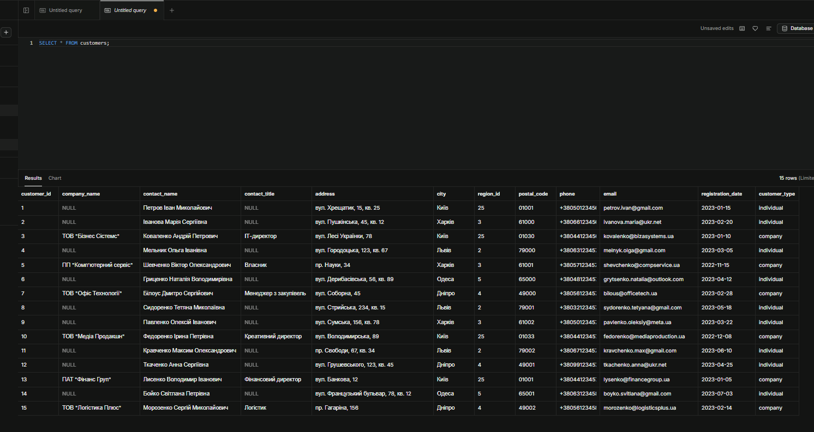

### Вивести тільки назви товарів і їхні ціни з таблиці products.

```sql
SELECT product_name, unit_price
FROM products;
```

Результат: Отримано 25 товарів із назвою та ціною, без зайвих стовпців (опис, постачальник тощо).

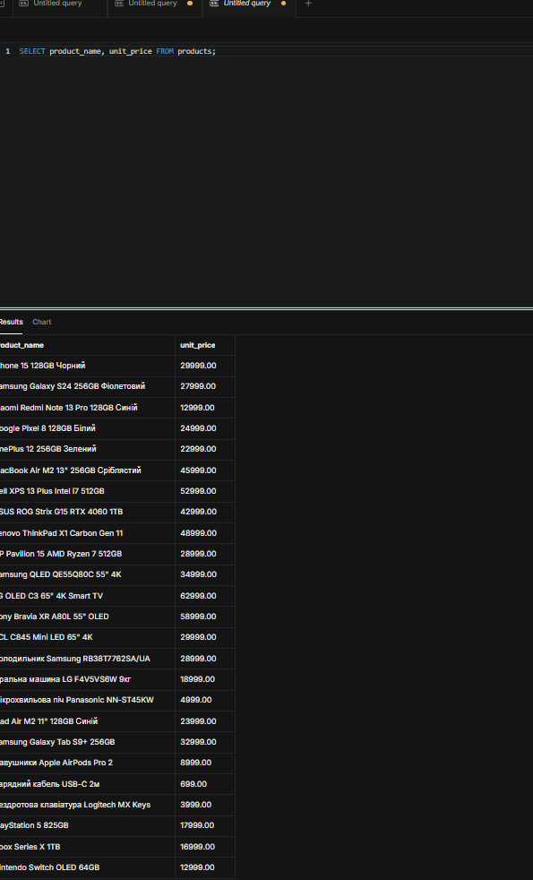

### Показати контактні дані всіх співробітників.

```sql
SELECT first_name, last_name, phone, email
FROM employees;
```

Результат: Отримано контактні дані 8 співробітників компанії — ім'я, прізвище, телефон, email.

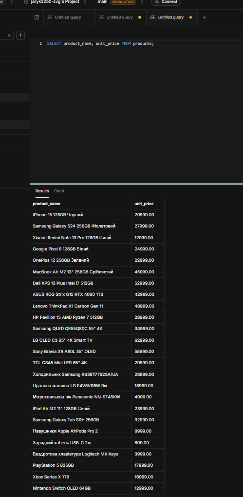

### Знайти всіх клієнтів з міста Київ.

```sql
SELECT * FROM customers
WHERE city = 'Київ';
```

Результат: Знайдено 4 клієнти з міста Київ.

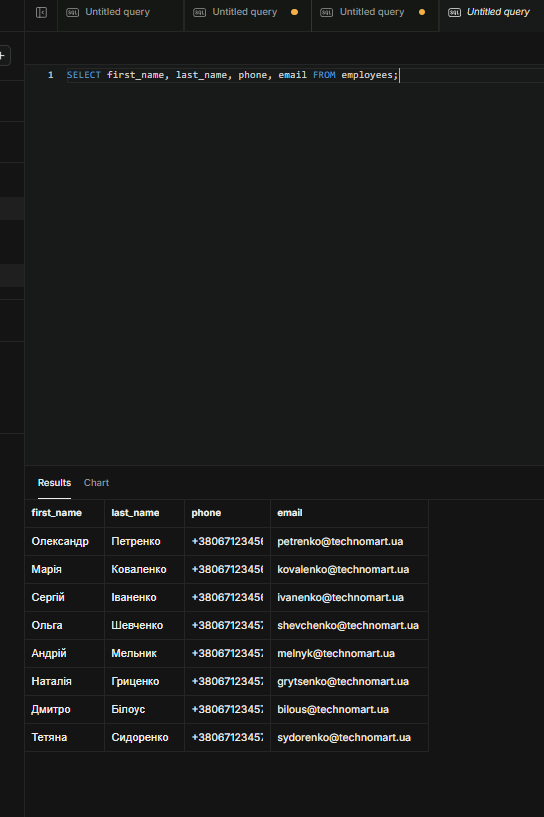

### Вивести товари, які коштують більше 25000 грн.

```sql
SELECT * FROM products
WHERE unit_price > 25000;
```

Результат: Знайдено 13 товарів вартістю понад 25000 грн.

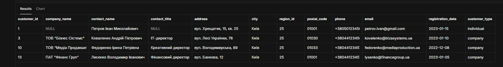

### Показати всі замовлення зі статусом 'delivered'.

```sql
SELECT * FROM orders
WHERE order_status = 'delivered';
```

Результат: Отримано список доставлених замовлень — більшість замовлень у базі мають саме цей статус.

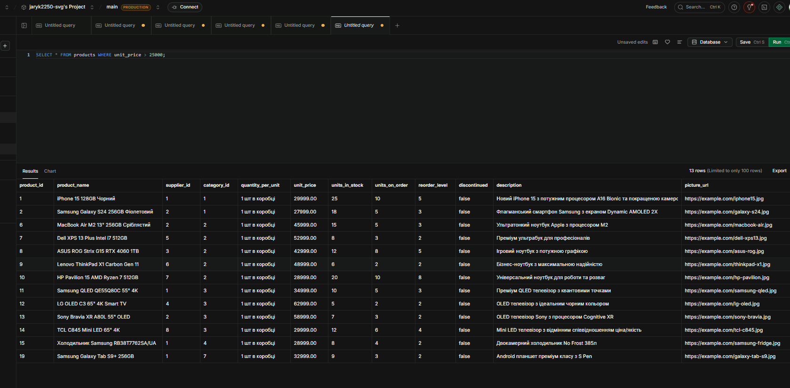

### Знайти співробітників, які працюють у відділі продажів.

```sql
SELECT * FROM employees
WHERE title ILIKE '%продаж%';
```

Результат: Знайдено 3 співробітників з посадою "Менеджер з продаж".

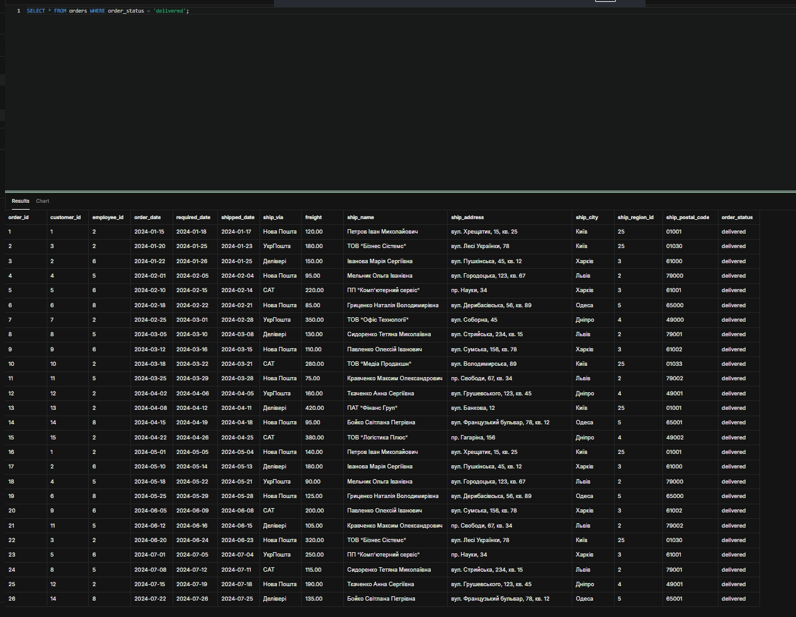

### Відсортувати товари за зростанням ціни.

```sql
SELECT * FROM products
ORDER BY unit_price ASC;
```

Результат: Товари відсортовано від найдешевшого (Зарядний кабель USB-C, 699 грн) до найдорожчого (LG OLED C3, 62999 грн).

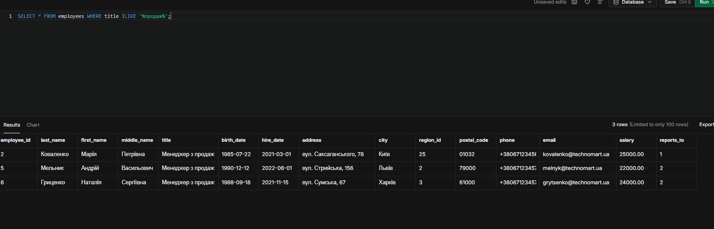

### Показати клієнтів в алфавітному порядку за іменем контактної особи.

```sql
SELECT * FROM customers
ORDER BY contact_name ASC;
```

Результат: Клієнти відсортовані за алфавітом за полем contact_name.

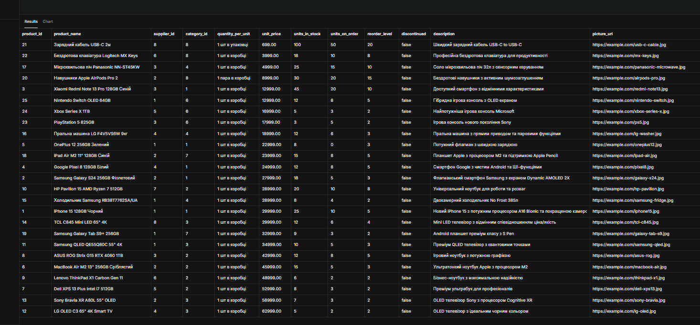

### Вивести замовлення від найновіших до найстаріших.

```sql
SELECT * FROM orders
ORDER BY order_date DESC;
```

Результат: Замовлення відсортовано від найновішого (2024-08-20) до найстарішого (2024-01-15).

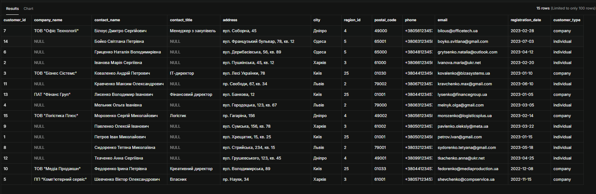

### Показати перші 10 найдорожчих товарів.

```sql
SELECT * FROM products
ORDER BY unit_price DESC
LIMIT 10;
```

Результат: Отримано топ-10 найдорожчих товарів каталогу, від LG OLED C3 (62999 грн) до iPhone 15 (29999 грн).

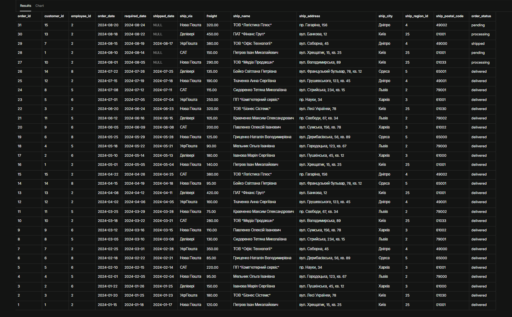

### Вивести 5 останніх замовлень (за датою).

```sql
SELECT * FROM orders
ORDER BY order_date DESC
LIMIT 5;
```

Результат: Отримано 5 найновіших замовлень бази (від 2024-08-01 до 2024-08-20).

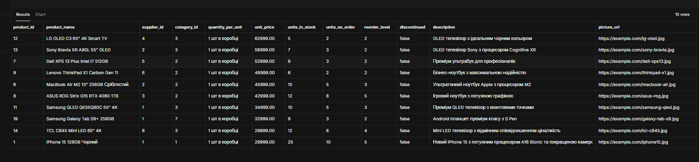

### Отримати перших 8 клієнтів в алфавітному порядку.

```sql
SELECT * FROM customers
ORDER BY contact_name ASC
LIMIT 8;
```

Результат: Отримано перших 8 клієнтів за алфавітом.

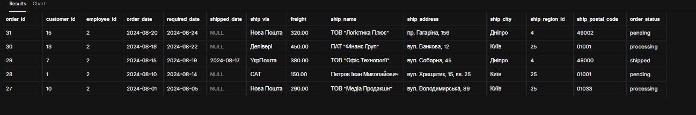

---

## Рівень 2

### Знайти всіх клієнтів, чиї імена починаються на "Іван".

```sql
SELECT * FROM customers WHERE contact_name LIKE 'Іван%';
```

Результат: Знайдено 1 клієнта — "Іванова Марія Сергіївна" (шаблон `Іван%` ловить будь-яке продовження після "Іван").

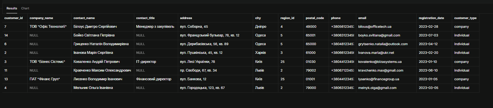

### Вивести товари, в назві яких є слово "phone" або "телефон".

```sql
SELECT * FROM products WHERE product_name ILIKE '%phone%' OR product_name ILIKE '%телефон%';
```

Результат: Знайдено 1 товар — "iPhone 15 128GB Чорний" (ILIKE не чутливий до регістру, тому "phone" збігається з частиною "iPhone").

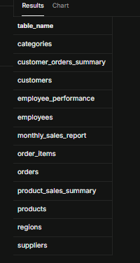

### Самостійний запит LIKE: пошук за зразком "містить"

```sql
-- Клієнти з прізвищем, що містить "енко"
SELECT contact_name, city FROM customers WHERE contact_name LIKE '%енко%';
```

Бізнес-логіка: сегментація клієнтської бази за поширеним українським прізвищем для локалізованої розсилки.

Результат: Знайдено 10 клієнтів із прізвищем на "енко" (Коваленко, Шевченко, Гриценко та інші).

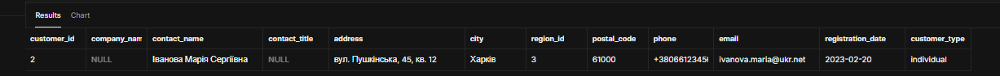

### Самостійний запит LIKE: пошук за зразком "починається на"

```sql
-- Товари, назва яких починається на "Samsung"
SELECT product_name, unit_price FROM products WHERE product_name LIKE 'Samsung%';
```

Бізнес-логіка: швидкий відбір усіх товарів одного бренду для аналізу асортименту.

Результат: Знайдено 3 товари бренду Samsung.

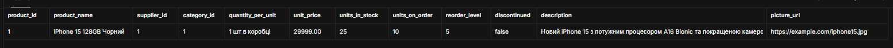

### Самостійний запит LIKE: пошук за зразком "закінчується на"

```sql
-- Товари, назва яких закінчується на "4K"
SELECT product_name, unit_price FROM products WHERE product_name LIKE '%4K';
```

Бізнес-логіка: відбір товарів з підтримкою 4K-роздільності для окремої категорії на сайті.

Результат: Знайдено 2 товари (телевізори з роздільністю 4K).

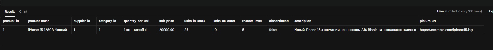

### Знайти товари дорожчі за 15000 грн і дешевші за 50000 грн.

```sql
SELECT * FROM products WHERE unit_price > 15000 AND unit_price < 50000;
```

Результат: Знайдено 16 товарів у вказаному ціновому діапазоні.

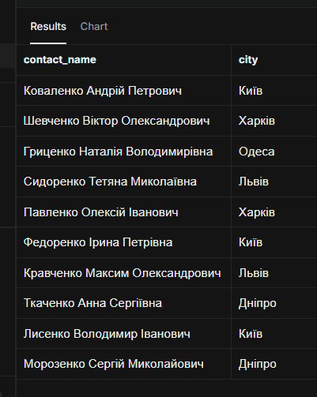

### Вивести клієнтів з Києва або Львова, які є юридичними особами.

```sql
SELECT * FROM customers WHERE (city = 'Київ' OR city = 'Львів') AND customer_type = 'company';
```

Результат: Знайдено 3 компанії (усі з Києва; юридичних осіб у Львові в базі немає).

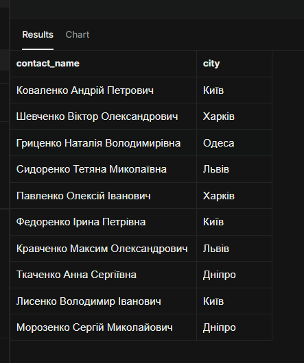

### Самостійний запит (логічні оператори): товари в наявності, не зняті з виробництва

```sql
SELECT product_name, units_in_stock FROM products WHERE units_in_stock > 0 AND NOT discontinued;
```

Бізнес-логіка: список товарів, реально доступних для продажу прямо зараз.

Результат: Усі 25 товарів бази в наявності й активні (жоден не знятий з виробництва).

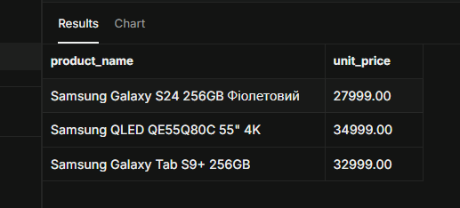

### Самостійний запит (логічні оператори): замовлення в роботі

```sql
SELECT * FROM orders WHERE order_status = 'pending' OR order_status = 'processing';
```

Бізнес-логіка: черга замовлень, які потребують уваги менеджера (ще не відправлені).

Результат: Знайдено 4 замовлення зі статусом pending або processing.

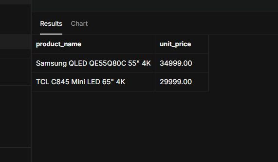

### Самостійний запит (логічні оператори): фізособи Харкова, зареєстровані до 2023-03-01

```sql
SELECT contact_name, city, registration_date FROM customers 
WHERE customer_type = 'individual' AND city = 'Харків' AND registration_date < '2023-03-01';
```

Бізнес-логіка: список "давніх" клієнтів-фізосіб для програми лояльності.

Результат: Знайдено 1 клієнта — Іванова Марія Сергіївна (зареєстрована 2023-02-20).

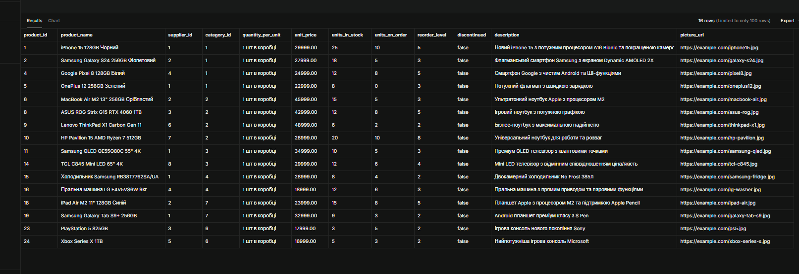

### Самостійний запит (логічні оператори): дорогі товари АБО товари з малим залишком

```sql
SELECT product_name, unit_price, units_in_stock FROM products WHERE unit_price > 40000 OR units_in_stock < 5;
```

Бізнес-логіка: товари під особливий контроль запасів — дорогі (великий капітал) або з низьким залишком (ризик дефіциту).

Результат: Знайдено 7 товарів.

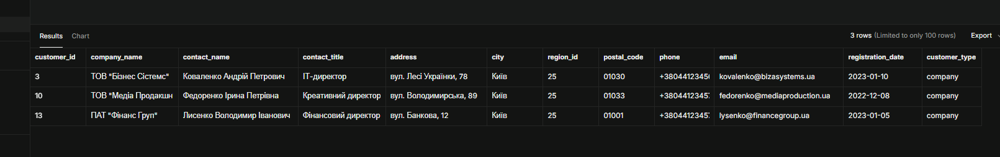

### Вивести клієнтів з міст Київ, Харків, Одеса, Дніпро.

```sql
SELECT * FROM customers WHERE city IN ('Київ', 'Харків', 'Одеса', 'Дніпро');
```

Результат: Знайдено 12 клієнтів із зазначених міст (з 15 загалом).

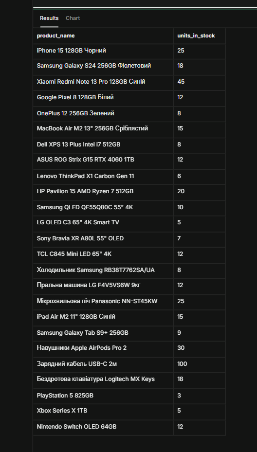

### Знайти товари в ціновому діапазоні від 10000 до 30000 грн.

```sql
SELECT * FROM products WHERE unit_price BETWEEN 10000 AND 30000;
```

Результат: Знайдено 13 товарів у діапазоні.

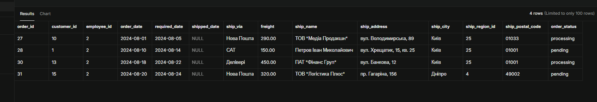

### Самостійний запит (IN, а): успішні замовлення

```sql
SELECT * FROM orders WHERE order_status IN ('delivered', 'shipped');
```

Бізнес-логіка: звіт про виконані поставки за період.

Результат: Знайдено 27 замовлень зі статусом delivered або shipped.

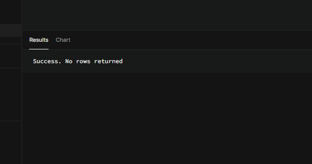

### Самостійний запит (IN, б): керівний склад

```sql
SELECT first_name, last_name, title FROM employees WHERE title IN ('Генеральний директор', 'Головний бухгалтер');
```

Бізнес-логіка: список топ-менеджменту для розсилки квартальних звітів.

Результат: Знайдено 2 співробітники (Генеральний директор та Головний бухгалтер).

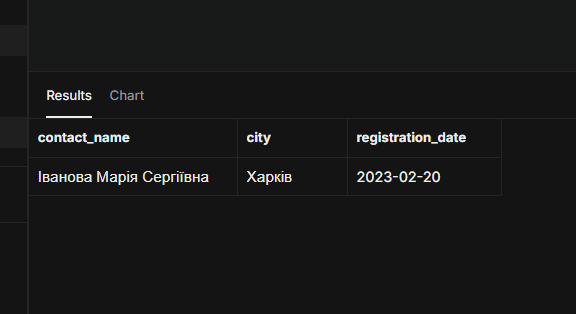

### Самостійний запит (BETWEEN, а): замовлення за 2024 рік

```sql
SELECT * FROM orders WHERE order_date BETWEEN '2024-01-01' AND '2024-12-31';
```

Бізнес-логіка: річний звіт по продажах.

Результат: Усі 31 замовлення бази потрапляють у 2024 рік.

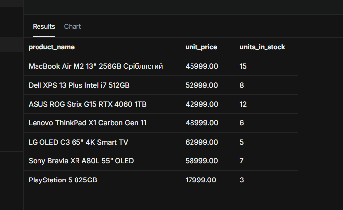

### Самостійний запит (BETWEEN, б): бюджетний сегмент товарів

```sql
SELECT product_name, unit_price FROM products WHERE unit_price BETWEEN 1000 AND 5000;
```

Бізнес-логіка: підбір товарів для акції "Бюджетний вибір".

Результат: Знайдено 2 товари (мікрохвильова піч, бездротова клавіатура).

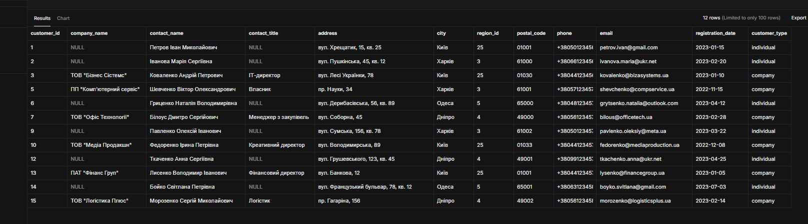

### Самостійний запит (IS NULL, а): не відправлені замовлення

```sql
SELECT order_id, order_date FROM orders WHERE shipped_date IS NULL;
```

Бізнес-логіка: список замовлень для складу — потребують відвантаження.

Результат: Знайдено 4 не відправлені замовлення.

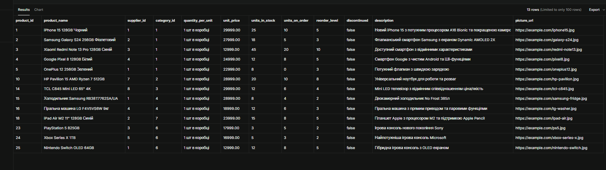

### Самостійний запит (IS NOT NULL, б): клієнти з вказаним email

```sql
SELECT contact_name, email FROM customers WHERE email IS NOT NULL;
```

Бізнес-логіка: сегмент клієнтів, доступних для email-розсилки.

Результат: Усі 15 клієнтів бази мають вказаний email.

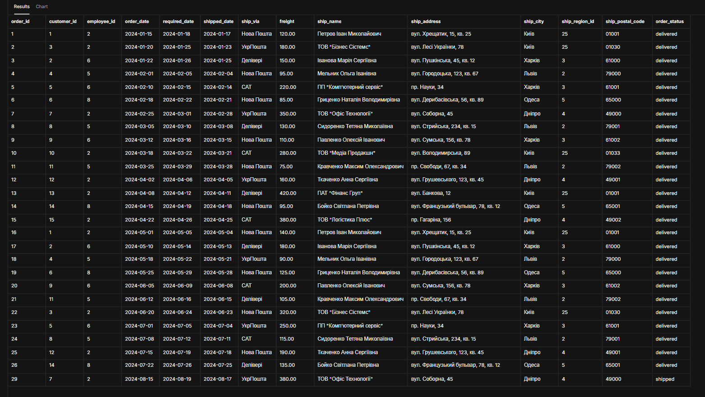

### Комбінування умов (1): клієнти Києва на літеру "К"

```sql
SELECT contact_name, city FROM customers WHERE city = 'Київ' AND contact_name LIKE 'К%';
```

Бізнес-логіка: локальна акція для київських клієнтів на конкретну літеру.

Результат: Знайдено 1 клієнта — Коваленко Андрій Петрович.

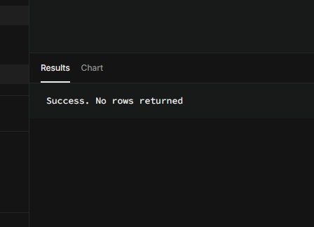

### Комбінування умов (2): товари середньої ціни в категоріях 1, 2, 3

```sql
SELECT product_name, unit_price, category_id FROM products 
WHERE unit_price BETWEEN 10000 AND 40000 AND category_id IN (1, 2, 3);
```

Бізнес-логіка: підбір товарів для каталогу "Оптимальний вибір".

Результат: Знайдено 8 товарів.

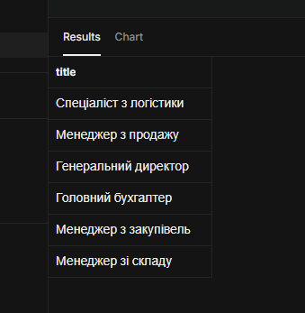

### Комбінування умов (3): смартфони Apple/Samsung в наявності

```sql
SELECT product_name, unit_price, units_in_stock FROM products 
WHERE (product_name ILIKE '%Apple%' OR product_name ILIKE '%Samsung%') AND units_in_stock > 0;
```

Бізнес-логіка: вітрина "Смартфони та гаджети в наявності" на сайті.

Результат: Знайдено 5 товарів.

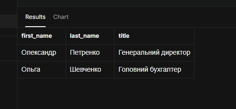

### Комбінування умов (4): товари без "чохол" у середньому сегменті

```sql
SELECT product_name, unit_price FROM products 
WHERE product_name NOT ILIKE '%чохол%' AND unit_price BETWEEN 5000 AND 60000;
```

Бізнес-логіка: виключення аксесуарів з аналізу "основних" товарів середнього і преміум сегментів.

Результат: Знайдено 18 товарів.

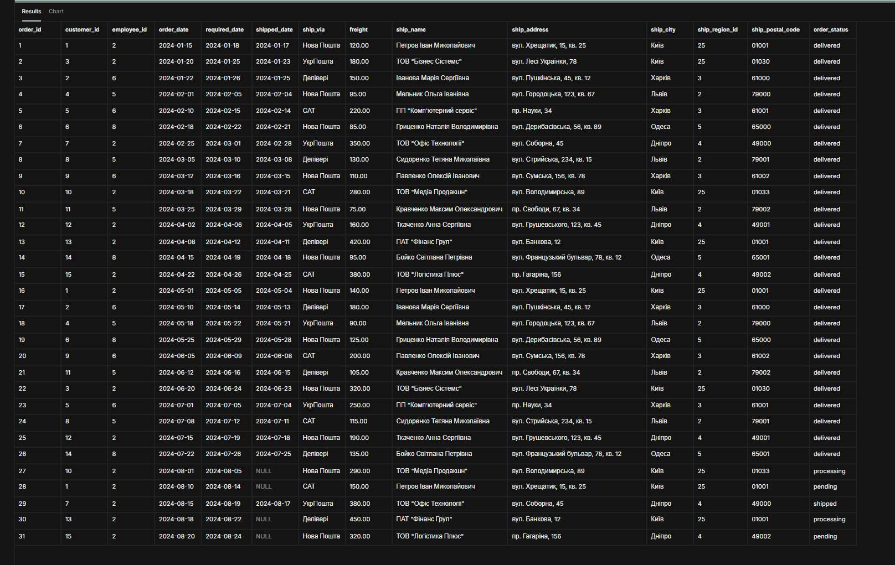

### Комбінування умов (5): компанії з великих міст

```sql
SELECT contact_name, city, registration_date FROM customers 
WHERE customer_type = 'company' AND city IN ('Київ', 'Харків', 'Одеса');
```

Бізнес-логіка: сегмент B2B-клієнтів у ключових містах присутності.

Результат: Знайдено 4 компанії.

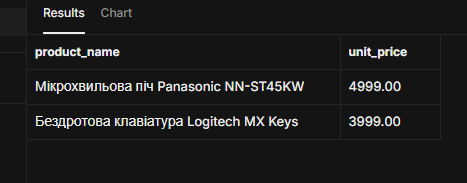

### Складне сортування (1): товари за категорією і ціною

```sql
SELECT product_name, category_id, unit_price FROM products ORDER BY category_id ASC, unit_price DESC;
```

Результат: Товари згруповані за категорією (за зростанням), а всередині кожної категорії відсортовані за ціною (за спаданням).

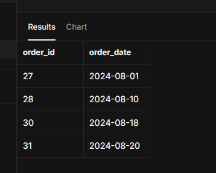

### Складне сортування (2): клієнти за типом, містом, ім'ям

```sql
SELECT contact_name, customer_type, city FROM customers ORDER BY customer_type DESC, city ASC, contact_name ASC;
```

Результат: Спочатку йдуть фізичні особи (individual, бо "i" > "c" за алфавітом при DESC), потім компанії, кожна група відсортована за містом і ім'ям.

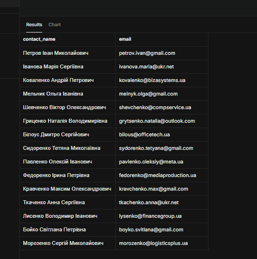

### Складне сортування (3): замовлення за статусом і датою

```sql
SELECT order_id, order_status, order_date FROM orders ORDER BY order_status ASC, order_date DESC;
```

Результат: Замовлення згруповані за статусом (алфавітно), всередині кожної групи — від найновішої дати до найстарішої.

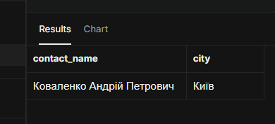

### Пагінація (1): товари, сторінка 2

```sql
SELECT product_name, unit_price FROM products ORDER BY product_name LIMIT 10 OFFSET 10;
```

Результат: Отримано записи 11-20 з відсортованого за назвою списку товарів.

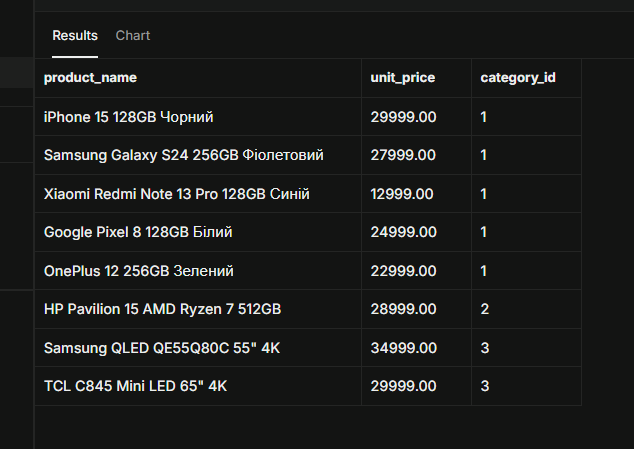

### Пагінація (2): клієнти, сторінка 2

```sql
SELECT contact_name, city FROM customers ORDER BY contact_name LIMIT 10 OFFSET 10;
```

Примітка: клієнтів усього 15, тому "сторінка 3" (OFFSET 20) поверне 0 рядків — показано сторінку 2 (записи 11-15).

Результат: Отримано останніх 5 клієнтів з відсортованого за ім'ям списку.

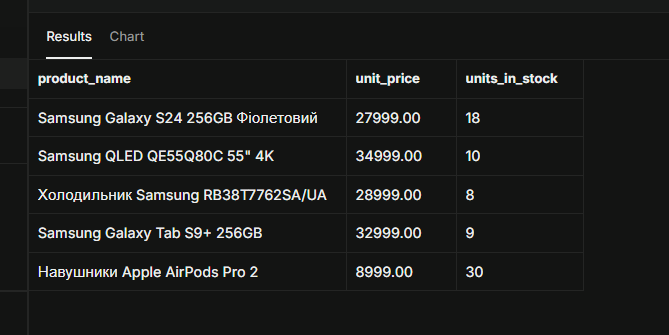

---

## Рівень 3

### Знайти товари, в назві яких є "Samsung" або "Apple", але немає слова "чохол".

```sql
SELECT product_name, unit_price
FROM products
WHERE (product_name ILIKE '%Samsung%' OR product_name ILIKE '%Apple%')
  AND product_name NOT ILIKE '%чохол%';
```

Результат: Знайдено 5 товарів (Samsung та Apple), серед яких немає жодного чохла.

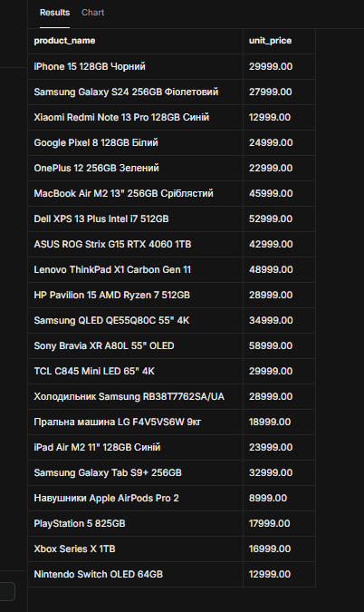

### Самостійний запит (LIKE + логіка, 1): товари "Pro" від 5000 грн

```sql
SELECT product_name, unit_price FROM products WHERE product_name ILIKE '%Pro%' AND unit_price >= 5000;
```

Бізнес-логіка: список товарів для розділу "Pro-лінійка" на сайті.

Результат: Знайдено 2 товари (Xiaomi Redmi Note 13 Pro, Apple AirPods Pro 2).

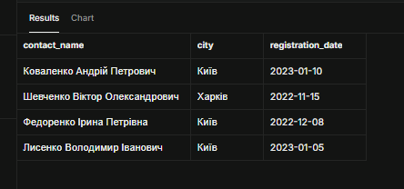

### Самостійний запит (LIKE + логіка, 2): клієнти на "А"/"Б" не з Києва

```sql
SELECT contact_name, city FROM customers 
WHERE (contact_name LIKE 'А%' OR contact_name LIKE 'Б%') AND city != 'Київ';
```

Бізнес-логіка: регіональна акція, що не перетинається з київською.

Результат: Знайдено 2 клієнти (Дніпро, Одеса).

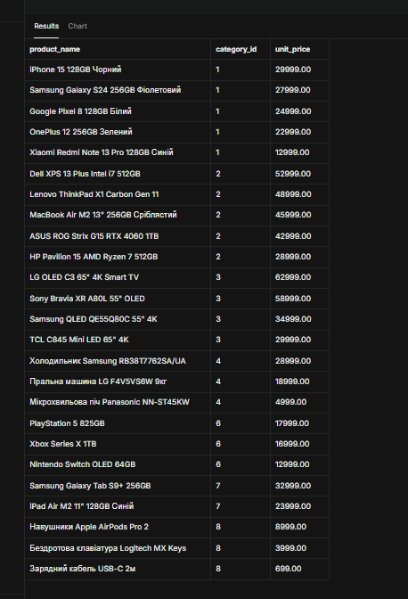

### Самостійний запит (LIKE + логіка, 3): товари з описом без "б/в"

```sql
SELECT product_name, description FROM products WHERE description IS NOT NULL AND product_name NOT ILIKE '%б/в%';
```

Бізнес-логіка: каталог нових товарів з повним описом для сайту.

Результат: Усі 25 товарів бази мають опис і жоден не є вживаним.

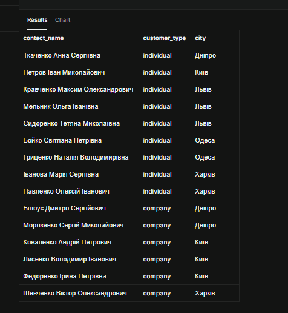

### Самостійний запит (LIKE + логіка, 4): продавці або корпоративна пошта

```sql
SELECT first_name, last_name, title, email FROM employees WHERE title ILIKE '%продаж%' OR email ILIKE '%@technomart%';
```

Бізнес-логіка: список для розсилки внутрішнього оновлення CRM.

Результат: Усі 8 співробітників мають корпоративну пошту @technomart.ua.

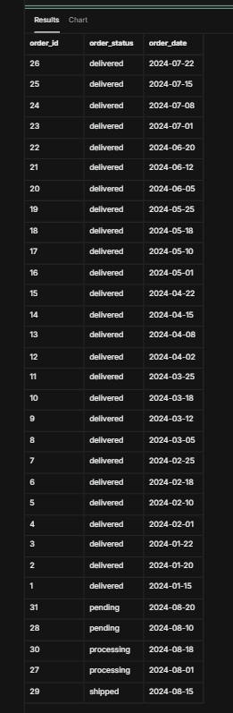

### Знайти товари дорожчі 20000 грн (категорії 1 або 2) АБО товари дешевші 5000 грн будь-якої категорії.

```sql
SELECT product_name, unit_price, category_id
FROM products
WHERE (unit_price > 20000 AND category_id IN (1, 2))
   OR (unit_price < 5000);
```

Результат: Знайдено 11 товарів.

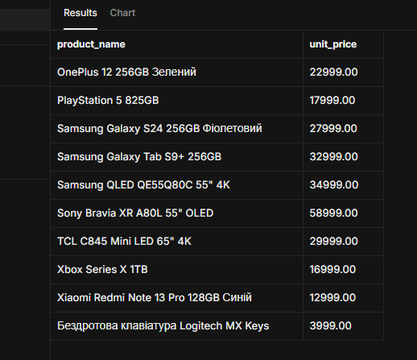

### Самостійний запит (вкладена умова, 1): компанії Києва АБО фізособи Львова з email

```sql
SELECT contact_name, city, customer_type FROM customers 
WHERE (customer_type = 'company' AND city = 'Київ')
   OR (customer_type = 'individual' AND city = 'Львів' AND email IS NOT NULL);
```

Бізнес-логіка: два сегменти для однієї email-кампанії з різним текстом листа.

Результат: Знайдено 6 клієнтів (3 компанії Києва + 3 фізособи Львова).

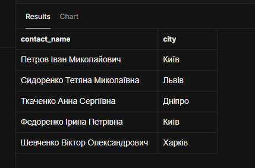

### Самостійний запит (вкладена умова, 2): категорія 1 в наявності АБО категорія 2 дешевше 10000

```sql
SELECT product_name, category_id, unit_price, units_in_stock FROM products 
WHERE (category_id = 1 AND units_in_stock > 0)
   OR (category_id = 2 AND unit_price < 10000);
```

Бізнес-логіка: підбір товарів для головного банера "Топ пропозиції".

Результат: Знайдено 5 товарів (усі категорії 1; у категорії 2 нема нічого дешевше 10000).

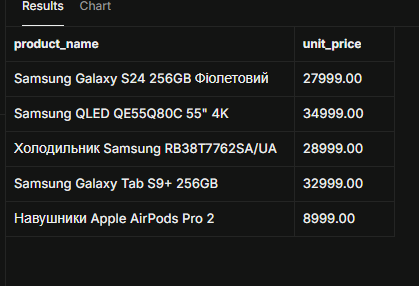

### Самостійний запит (вкладена умова, 3): доставлені у 2024 АБО ще не відправлені

```sql
SELECT order_id, order_status, order_date, shipped_date FROM orders 
WHERE (order_status = 'delivered' AND order_date BETWEEN '2024-01-01' AND '2024-12-31')
   OR (shipped_date IS NULL);
```

Бізнес-логіка: звіт для складу — що вже закрито за рік і що досі в роботі.

Результат: Знайдено 30 замовлень (26 доставлених + 4 не відправлених).

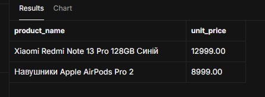

### Комплексний звіт товарів з 5+ умовами фільтрації

```sql
SELECT
    product_name AS "Назва товару",
    unit_price AS "Ціна, грн",
    units_in_stock AS "На складі",
    category_id AS "Категорія"
FROM products
WHERE
    unit_price BETWEEN 15000 AND 60000
    AND units_in_stock > 0
    AND NOT discontinued
    AND product_name NOT ILIKE '%чохол%'
    AND description IS NOT NULL
ORDER BY unit_price DESC;
```

Бізнес-логіка: підбір товарів-кандидатів для сезонної розпродажі — активні, в наявності, середній/преміум сегмент, без аксесуарів, з описом.

Результат: Знайдено 17 товарів.

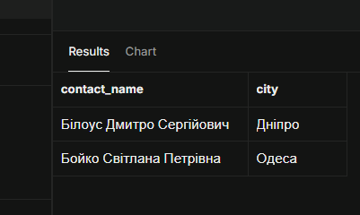

### Аналіз клієнтської бази з множинними критеріями відбору

```sql
SELECT
    contact_name, city, customer_type,
    CASE
        WHEN customer_type = 'company' AND city = 'Київ' THEN 'VIP корпоративний клієнт'
        WHEN customer_type = 'company' THEN 'Корпоративний клієнт'
        WHEN city IN ('Київ', 'Харків', 'Львів') THEN 'Клієнт великого міста'
        ELSE 'Регіональний клієнт'
    END AS сегмент
FROM customers
WHERE email IS NOT NULL AND contact_name NOT ILIKE '%тест%'
ORDER BY customer_type DESC, city, contact_name;
```

Бізнес-логіка: сегментація клієнтів для персоналізованої розсилки.

Результат: Усі 15 клієнтів розподілено на 4 сегменти (VIP корпоративний, корпоративний, великого міста, регіональний).

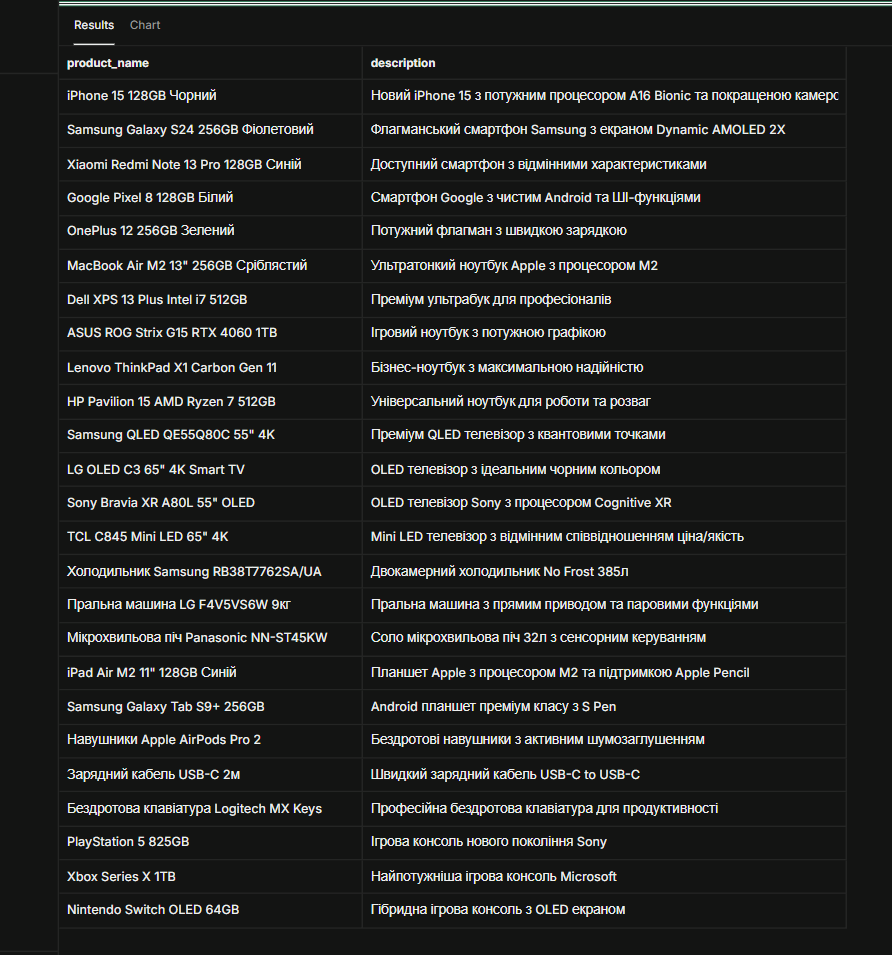

### Цінові сегменти (1): розподіл товарів

```sql
SELECT
    CASE
        WHEN unit_price < 5000 THEN 'Бюджетний'
        WHEN unit_price < 20000 THEN 'Середній'
        WHEN unit_price < 50000 THEN 'Преміум'
        ELSE 'Люкс'
    END AS "Ціновий сегмент",
    COUNT(*) AS "Кількість товарів"
FROM products
GROUP BY 1
ORDER BY MIN(unit_price);
```

Результат: Бюджетний — 3, Середній — 6, Преміум — 13, Люкс — 3 товари.

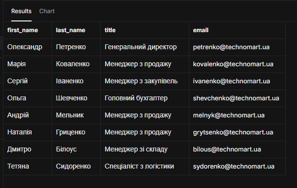

### Цінові сегменти (2): топ товарів у сегменті "Люкс"

```sql
SELECT product_name, unit_price FROM products WHERE unit_price >= 50000 ORDER BY unit_price DESC LIMIT 5;
```

Результат: Знайдено 3 товари в сегменті "Люкс" (LG OLED C3, Sony Bravia, Dell XPS 13 Plus).

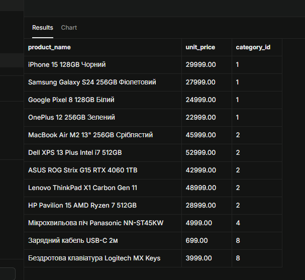

### Цінові сегменти (3): середня ціна по категоріях

```sql
SELECT category_id, ROUND(AVG(unit_price), 2) AS "Середня ціна" FROM products GROUP BY category_id ORDER BY "Середня ціна" DESC;
```

Результат: Найдорожча категорія в середньому — 3 (телевізори, 46749 грн), найдешевша — 8 (аксесуари, 4565.67 грн).

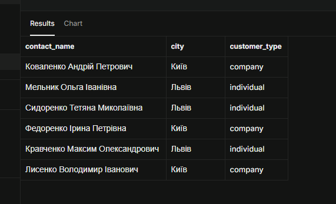

### Географія клієнтів (1): кількість клієнтів по містах

```sql
SELECT city, COUNT(*) AS "Кількість клієнтів" FROM customers GROUP BY city ORDER BY "Кількість клієнтів" DESC;
```

Результат: Київ — 4, Львів — 3, Харків — 3, Дніпро — 3, Одеса — 2.

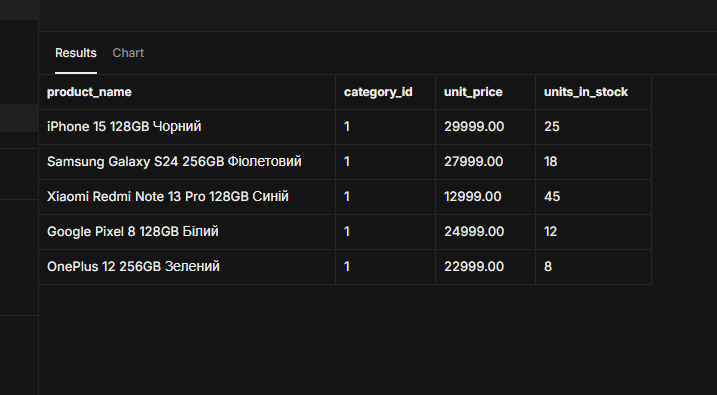

### Географія клієнтів (2): частка юросіб у кожному місті

```sql
SELECT city, customer_type, COUNT(*) AS "Кількість" FROM customers GROUP BY city, customer_type ORDER BY city, customer_type;
```

Результат: Детальний розподіл company/individual по кожному місту.

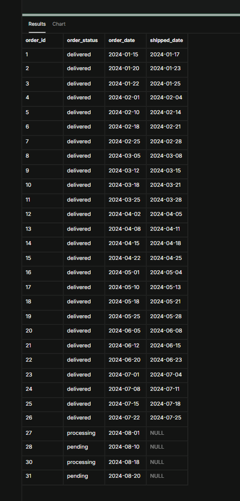

### Географія клієнтів (3): міста з компаніями

```sql
SELECT DISTINCT city FROM customers WHERE customer_type = 'company';
```

Бізнес-логіка: визначення міст присутності B2B-сегмента.

Результат: 3 міста — Дніпро, Київ, Харків.

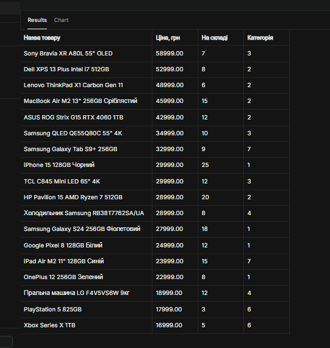

### Географія клієнтів (4): топ-5 міст за кількістю компаній

```sql
SELECT city, COUNT(*) AS "К-сть компаній" FROM customers WHERE customer_type = 'company' GROUP BY city ORDER BY "К-сть компаній" DESC LIMIT 5;
```

Результат: Київ — 3, Дніпро — 2, Харків — 1.

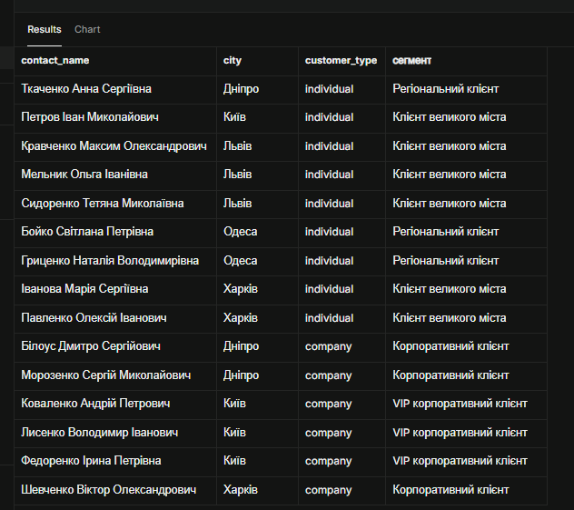

### Часові патерни (1): замовлення по місяцях

```sql
SELECT DATE_TRUNC('month', order_date) AS "Місяць", COUNT(*) AS "К-сть замовлень" FROM orders GROUP BY 1 ORDER BY 1;
```

Результат: Кількість замовлень по місяцях 2024 року коливається від 3 до 5, з піком у серпні (5).

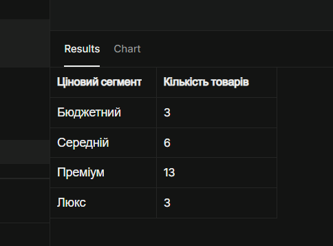

### Часові патерни (2): середній час доставки

```sql
SELECT ROUND(AVG(shipped_date - order_date), 1) AS "Середній час доставки, днів" FROM orders WHERE shipped_date IS NOT NULL;
```

Результат: Середній час від замовлення до відправки — 3.0 дні.

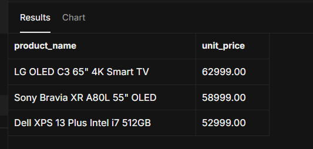

### Часові патерни (3): розподіл замовлень за статусами

```sql
SELECT order_status, COUNT(*) AS "К-сть" FROM orders GROUP BY order_status ORDER BY "К-сть" DESC;
```

Результат: delivered — 26, pending — 2, processing — 2, shipped — 1.

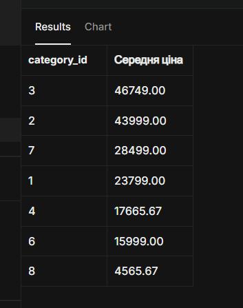

### Креативне завдання (1): товари-довгожителі на складі

```sql
SELECT product_name, unit_price, units_in_stock FROM products WHERE units_in_stock > 10 AND unit_price > 20000 ORDER BY units_in_stock DESC;
```

Бізнес-логіка: кандидати на уцінку — заморожений капітал на складі.

Результат: Знайдено 8 товарів.

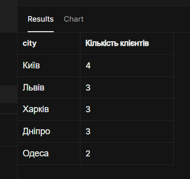

### Креативне завдання (2): клієнти-новачки

```sql
SELECT contact_name, city, registration_date FROM customers ORDER BY registration_date DESC LIMIT 5;
```

Бізнес-логіка: список для welcome-розсилки новим клієнтам.

Результат: 5 найновіших клієнтів за датою реєстрації.

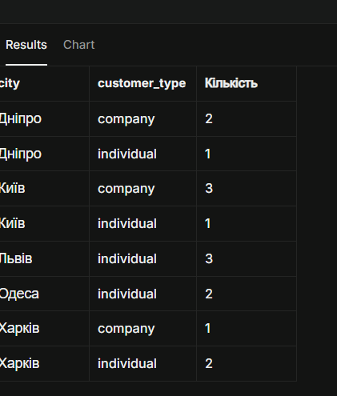

### Креативне завдання (3): найдешевші й найдорожчі товари через UNION

```sql
(SELECT product_name, unit_price, 'Найдешевші' AS група FROM products ORDER BY unit_price ASC LIMIT 3)
UNION ALL
(SELECT product_name, unit_price, 'Найдорожчі' AS група FROM products ORDER BY unit_price DESC LIMIT 3);
```

Бізнес-логіка: наочно показати цінову вилку каталогу для презентації.

Результат: 3 найдешевших і 3 найдорожчих товари в одній таблиці.

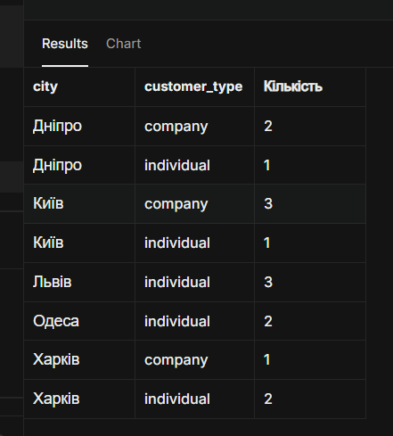

### Креативне завдання (4): замовлення-довгобуди

```sql
SELECT order_id, order_date, order_status FROM orders WHERE shipped_date IS NULL AND order_date < CURRENT_DATE - INTERVAL '7 days';
```

Бізнес-логіка: сигнал для менеджера — прострочені поставки.

Результат: Знайдено 4 замовлення, не відправлені понад 7 днів.

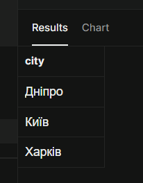

### Креативне завдання (5): частка товарів по відомих брендах

```sql
SELECT
    CASE
        WHEN product_name ILIKE '%Apple%' THEN 'Apple'
        WHEN product_name ILIKE '%Samsung%' THEN 'Samsung'
        WHEN product_name ILIKE '%Xiaomi%' THEN 'Xiaomi'
        ELSE 'Інші бренди'
    END AS бренд,
    COUNT(*) AS "К-сть товарів"
FROM products
GROUP BY 1
ORDER BY "К-сть товарів" DESC;
```

Бізнес-логіка: аналіз асортиментної політики — на яких брендах тримається каталог.

Результат: Інші бренди — 19, Samsung — 4, Xiaomi — 1, Apple — 1 (менше, бо Apple-пристрої названі як MacBook/iPad/AirPods без слова "Apple" в назві).

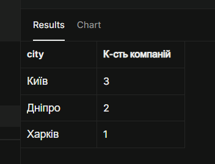

---

## Висновки

**Самооцінка**: [4-5]

**Обгрунтування**: [Виконав завдання всіх трьох рівнів складності на базі даних technomart (PostgreSQL, Supabase) - у сумі понад 60 SQL-запитів. Розібрався з основними конструкціями SELECT: вибіркою всіх або окремих стовпців, фільтрацією через WHERE (точна відповідність, числові порівняння, шаблони LIKE/ILIKE з урахуванням регістру і без нього), логічними операторами AND, OR, NOT разом з групуванням умов через дужки - на практиці побачив, що AND має вищий пріоритет за OR, і без дужок запит легко дає неочікуваний результат. Попрацював з IN, BETWEEN для списків і діапазонів значень, а також з NULL через IS NULL/IS NOT NULL - переконався, що порівняння "= NULL" завжди повертає 0 рядків, і це не помилка, а особливість SQL. Відпрацював сортування ORDER BY за одним і кількома полями, LIMIT для обмеження виводу та пагінацію через LIMIT OFFSET. У рівні 3 додав агрегатні функції COUNT і AVG, групування GROUP BY, умовну логіку CASE WHEN, а також UNION ALL для об'єднання результатів двох підзапитів.

Найбільша складність - частина запитів з методички при запуску на реальних даних (усього 15 клієнтів, 25 товарів, 8 співробітників) поверталась порожньою. Наприклад, пошук клієнтів без email - у базі в усіх він є, або товарів дорожче 30000 грн зі словом "Pro" в назві - таких просто нема. Спочатку це збивало з пантелику, але потім зрозумів корисний підхід: перед написанням фінального запиту варто спершу глянути на реальні дані (SELECT DISTINCT ...), а не сліпо покладатись на приклад з умови завдання, і вже під фактичний вміст таблиць підлаштовувати умови фільтрації, не втрачаючи синтаксичну і логічну коректність запиту.]
